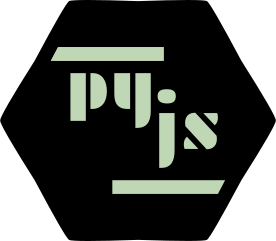

# pyjs
A bridge from node to python

## Setup
`npm install && pipenv install`

## How to use
Add any python function to `exports` array in `py/main.py`. Then that function can be accessed as an attribute of `py` in `main.js`. To run `main.js`, execute `npm start` from terminal. (Remember to run `pipenv shell` to enter virtualenv first.)

For example, in `py/main.py`:
```python
def foo(count):
    return f'bar-count: {count}'

exports = [foo]
```

And then in `main.js`:
```javascript
const py = require('./py');
py.foo(101).then(val => console.log(val)); // Displays 'bar-count: 101'
py.__stop__();
```

Calling `py.__stop__()` at the end signals the python server to stop as the node script has reached an end.

## How does it work
It uses `zerorpc` to facillitate communication between `js` codes and `py` codes. In python-end, a `TCP` server is opened, which listens to any remote-procedure-call from node.

## Limitations
Supports only functions. Classes and variables cannot be bridged. And as for return-value and arguments of the functions, only primitive types, arrays and dictionaries are supported.